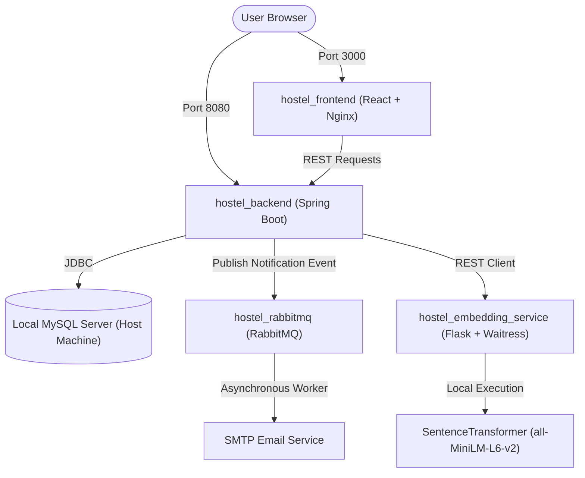

# Hostel Hub

Hostel Hub is a modern, containerized hostel complaint management system. It enables students to raise and track complaints, wardens to review and resolve issues, and administrators to monitor service quality and system operations.

## Features

- **Student Complaint Registration**: Simple portal for logging complaints with categorizations.
- **Complaint Image Upload**: Secure upload of images to illustrate complaint details.
- **Complaint Status Tracking**: Real-time updates on status transitions.
- **Role-Based Access Control (RBAC)**: Fine-grained access for Students, Wardens, and Admins.
- **JWT & Google OAuth2**: Robust security configuration supporting Google OAuth login and JWT tokens.
- **Forgot Password with OTP Verification**: Email-based passcode system for secure credentials recovery.
- **RabbitMQ Asynchronous Emails**: Event-driven notification dispatch for decoupled performance.
- **NLP Duplicate Complaint Detection**: Vector-based semantic similarity scanning using HuggingFace model embeddings.
- **Complaint Resolution Notifications**: Automatic email triggers on warden state updates.

## System Architecture



### Containerized Services Detail

1. **`hostel_frontend` (React + Nginx)**
   - **Technology**: React SPA, served by Nginx.
   - **Role**: Provides the client interface. The custom Nginx configuration acts as a lightweight web server, enabling client routing and standard gzip compression for fast loads.
   - **Ports**: Exposes port `3000`.

2. **`hostel_backend` (Spring Boot REST API)**
   - **Technology**: Java 17, Spring Boot, Spring Security (OAuth2/JWT), Hibernate/Spring Data JPA.
   - **Role**: Processes business logic, handles security, queries the database, triggers the duplicate detection client, and publishes events to RabbitMQ.
   - **Ports**: Exposes port `8080`. Connects to the host database via `host.docker.internal:3306`.

3. **`hostel_rabbitmq` (RabbitMQ Message Broker)**
   - **Technology**: RabbitMQ (`3-management-alpine`).
   - **Role**: Manages the message queues for asynchronous email delivery. Features a Dead Letter Exchange (DLX) and Dead Letter Queue (DLQ) to ensure email processing resilience and administrative retry capabilities.
   - **Ports**: Exposes ports `5672` (AMQP messaging) and `15672` (Management Dashboard).

4. **`hostel_embedding_service` (AI/NLP Embedding Service)**
   - **Technology**: Python 3.10, PyTorch (CPU-optimized), Sentence-Transformers, Flask, Waitress.
   - **Role**: Converts raw text of complaints into 384-dimensional dense vectors to calculate similarity scores. Pre-caches the HuggingFace `all-MiniLM-L6-v2` model during build time to facilitate cold starts.
   - **Ports**: Exposes port `5000`.

5. **`Local MySQL Server` (Host Machine)**
   - **Technology**: MySQL Server.
   - **Role**: Relational data store. Spring Boot connects securely using parameters configured inside `.env`.

---

## Tech Stack

- **Frontend**: React.js
- **Backend**: Spring Boot, Spring Security, JWT Authentication, Spring Data JPA
- **Database**: MySQL
- **Authentication**: Google OAuth, JWT
- **Messaging**: RabbitMQ
- **Email**: SMTP Email Service
- **NLP**: `all-MiniLM-L6-v2` Embedding Service for Duplicate Complaint Detection
- **Containerization**: Docker, Docker Compose

## Running with Docker

Before running, copy `.env.example` to `.env` and configure your credentials.

Start the entire application stack:
```bash
docker-compose up --build
```

Stop and clean up containers:
```bash
docker-compose down
```

## Local Access Endpoints

- **Frontend Application**: [http://localhost:3000](http://localhost:3000)
- **Backend API Server**: [http://localhost:8080](http://localhost:8080)
- **RabbitMQ Admin Console**: [http://localhost:15672](http://localhost:15672) (User: `guest` | Pass: `guest`)

---

## Author

- **Partha Sai** (GitHub: [@Parthasai-12](https://github.com/Parthasai-12))
